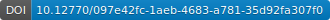

# OCTOPUS Software (multiformat checker, splitter and converter tool for [SeaDataNet formats](https://archimer.ifremer.fr/doc/00454/56547/))

## Badges

Assesment done on 16/09/2024

## Overview

OCTOPUS is a **multiformat checker, splitter and converter tool** for [SeaDataNet (SDN) formats](https://archimer.ifremer.fr/doc/00454/56547/). It is a unique and ergonomic tool for many format conversions.

The following conversions are possible with OCTOPUS:

- Non SDN MedAtlas to SDN MedAtlas
- Non SDN MedAtlas to SDN ODV
- Non SDN MedAtlas to SDN NetCDF
- Non SDN NetCDF Shipboard ADCP to SDN NetCDF
- SDN MedAtlas to SDN ODV
- SDN MedAtlas to SDN NetCDF
- SDN ODV to SDN NetCDF
- SDN NetCDF to SDN ODV

And for marine geophysical data:

- MGDv81 to SDN ODV
- MGDv98 to SDN ODV

OCTOPUS also allows:

- to split a multistation file into monostation ones
- to extract 1 to n stations from a multistation file and export them into another multistation file or several monostation ones
- to check the compliance of SDN MedAtlas, SDN ODV, SDN NetCDF and HFRadar NetCDF formats
- to check the compliance of ODV variant SDN formats for biology, microlitter and flow cytometry
- to convert EGO glider files to SDN netCDF (CFPoint) format
- to generate the SDN coupling table

### Available conversions

|⬇️input  output➡️ | [MedAtlas](http://en.data.ifremer.fr/All-about-data/Data-management/Formats/MedAtlas-Format) | [ODV](http://en.data.ifremer.fr/All-about-data/Data-management/Formats/ODV) | ODV variants | [netCDF (CF)](http://dx.doi.org/10.25607/OBP-408) |
|--------|---|---|---|-------------------------|
| MedAtlas non SDN |  
✅
 | 
✅
 | 
❌
 | 
✅
 |
| MedAtlas SDN | 
✅
 | 
✅
 | 
❌
 | 
✅
 |
| ODV SDN | 
❌
 | 
✅
 | 
❌
 | 
✅
 |
| ODV variants | 
❌
 | 
❌
 | 
✅
 | 
❌
 |
| netCDF SDN (Cfpoint) | 
❌
 | 
✅
 | 
❌
 | 
✅
 |
| MGDv81 | 
❌
 | 
✅
 | 
❌
 | 
❌
 |
| MGDv98 | 
❌
 | 
✅
 | 
❌
 | 
❌
 |
| netCDF gliders | 
❌
 | 
❌
 | 
❌
 | 
✅
 |
| netCDF S-ADCP | 
❌
 | 
❌
 | 
❌
 | 
✅
 |

> [!TIP]
> See also the [Octopus formats conversion table](https://github.com/seadatanet/octopus/blob/main/figures/octopus_conversions_table_20240710.jpg) as an image

## Contributors

Project Supervisor:

- [Steven PIEL](https://github.com/spiel-ifremer), [Ifremer](https://edmo.seadatanet.org/report/486), Brest, France, [ORCID:0009-0008-1759-5254](https://orcid.org/0009-0008-1759-5254)

Developers:

- Sébastien CROUZILLE, Capgemini Engineering, Brest, France
- Pierre MAHOUDO, Capgemini Engineering, Brest, France

Actual Contributors:

- Vincent FACHERO, [Ifremer](https://edmo.seadatanet.org/report/486), Brest, France
- Julie GATTI, [Ifremer](https://edmo.seadatanet.org/report/486), Brest, France, [ORCID:0000-0001-9327-4366](https://orcid.org/0000-0001-9327-4366)
- Françoise LE HINGRAT, [Ifremer](https://edmo.seadatanet.org/report/486), Brest, France
- Cécile PERTUISOT, [Ifremer](https://edmo.seadatanet.org/report/486), Brest, France, [ORCID:0000-0002-5474-2224](https://orcid.org/0000-0002-5474-2224)
- Marine VERNET, [Ifremer](https://edmo.seadatanet.org/report/486), Brest, France, [ORCID:0000-0002-3906-5579](https://orcid.org/0000-0002-3906-5579)

Past Contributors:

- Sophie BREGENT, [Ifremer](https://edmo.seadatanet.org/report/486), Brest, France
- Michèle FICHAUT, [Ifremer](https://edmo.seadatanet.org/report/486), Brest, France, [ORCID:0000-0001-5900-6149](https://orcid.org/0000-0001-5900-6149)
- Leo LE LONQUER, [Ifremer](https://edmo.seadatanet.org/report/486), Brest, France
- Vanessa TOSELLO, [Ifremer](https://edmo.seadatanet.org/report/486), Brest, France, [ORCID:0009-0009-7337-5245](https://orcid.org/0009-0009-7337-5245)

## Software metadata

### Domain

Physical oceanography

### Support

For any support or question please contact [sdn-userdesk@seadatanet.org](mailto:sdn-userdesk@seadatanet.org)

### Funders

- [Ifremer](https://edmo.seadatanet.org/report/486)
- [European Commission](https://commission.europa.eu/index_en) under the [Horizon 2020](https://research-and-innovation.ec.europa.eu/funding/funding-opportunities/funding-programmes-and-open-calls/horizon-2020_en) (SeaDataNet projects: SeaDataNet, SeaDataNet 2, SeaDataCloud)

### Languages

- English
- French

### Programming languages

Java

### Date created

2024-07-04

### Keywords

SeaDataNet, check, convertion, split, ODV, netCDF, MedAtlas, MGD, EGO, ADCP, ODV variants, Biology (BODV), Flow cytometry, Microlitter in water column (MODV), Microlitter in sediments (SODV), CDI

## Requirements, Supported Environments, Installation

### Requirements

Octopus is written in Java.

Octopus is available in 2 versions:

- a "classic" version, without Java. It requires java 1.8.0_131 or greater (but lower than 1.9) already installed in the system.
- a "standalone" version, with Java 1.8.0_201 bundled into it (located in the `octopus/jre` directory).

### Supported Environments

The standalone version version doesn't require Java.

Octopus is available for multiple platforms: Windows, Linux. 32 bits platforms are not supported.

### Installation

Download the Octopus software from [SeaDataNet portal](https://www.seadatanet.org/Software/OCTOPUS/Download-Octopus-1.10.0).

Simply choose the version according to your system (Linux/Windows), and your Java configuration ("classic", "standalone").
Copy the zip file on your computer and unzip it. The change log is available in OCTOPUS menu `help> about`

## Get started

OCTOPUS can be used in interactive mode or in batch mode.

For settings and details of all other available functions, please refer to the [user manual](https://www.seadatanet.org/content/download/698/file/SDN_OCTOPUS_UserManual.pdf).

## License

[GNU Lesser General Public License v3.0 only](https://spdx.org/licenses/LGPL-3.0-only.html)